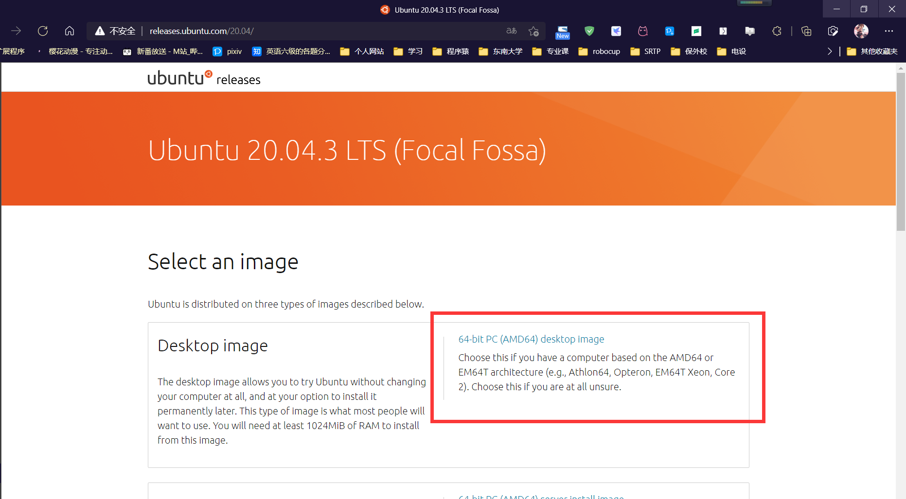
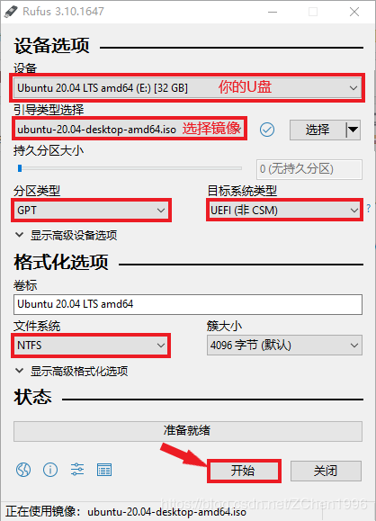
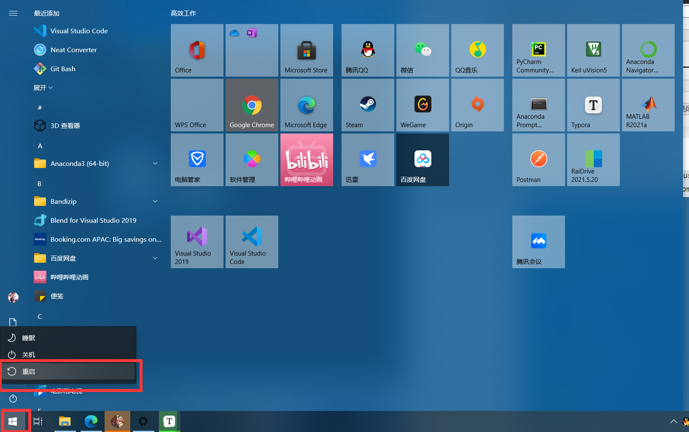
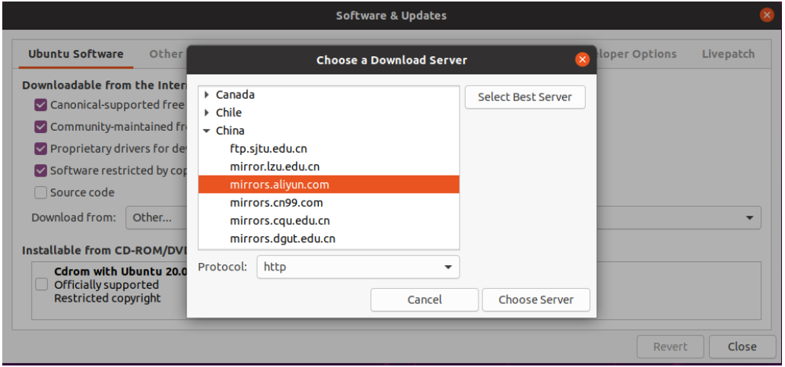
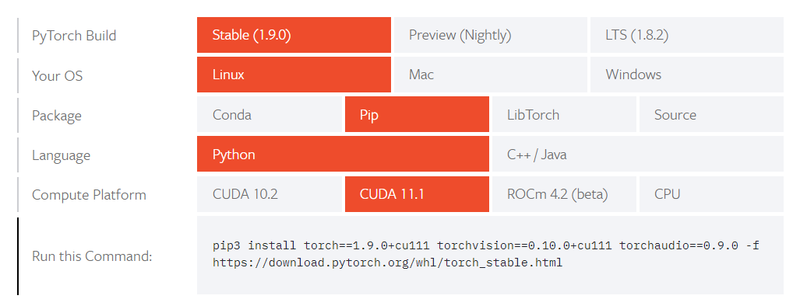

# Ubuntu20.04 Robocup教程

## 1.Ubuntu20.04安装教程【针对已经安装过Ubuntu的用户】

#### （1）下载桌面图像[ ubuntu.com 点击进入](http://releases.ubuntu.com/20.04/)



#### （2）Rufus烧录文件（exe见打包文件夹）



#### （3）按住SHIFT键鼠标点击重启，进入U盘启动界面



#### （4）安装Ubuntu务必选择【卸载并重新安装选项】

请勿清除整个磁盘，自定义分区是第一次安装双系统的设置

#### （5）走完一系列Ubuntu的基本配置即可（不多赘述）


## 2.Ros Noetic安装【请记牢这个版本的名字】

#### （1）设置ros源，让每次sudo apt-get update都找到这个仓库

```bash
$ sudo sh -c 'echo "deb http://packages.ros.org/ros/ubuntu $(lsb_release -sc) main" > /etc/apt/sources.list.d/ros-latest.list'
```

#### （2）切换系统源，采用国内的镜像网站下载，速度会快很多

打开软件与更新，选择【中国的服务器】，确认后会**自动**打开这个界面，建议选择【清华】



#### （3）添加ROS密钥【两种方法，建议后者】

```bash
$ sudo apt install curl # if you haven't already installed curl
$ curl -s https://raw.githubusercontent.com/ros/rosdistro/master/ros.asc | sudo apt-key add -
```

或者

```bash
$ sudo apt-key adv --keyserver 'hkp://keyserver.ubuntu.com:80' --recv-key C1CF6E31E6BADE8868B172B4F42ED6FBAB17C654
```

#### （4）更新源【至此，系统可以找到ROS的所有安装包】

```bash
$ sudo apt update
```

#### （5）安装ROS包

```bash
$ sudo apt-get install ros-noetic-desktop-full
$ sudo apt-get install ros-noetic-rqt*
```

#### （6）安装环境

```bash
$ source /opt/ros/noetic/setup.bash
$ echo "source /opt/ros/noetic/setup.bash" >> ~/.bashrc
$ source ~/.bashrc
```

#### （7）安装运行依赖

```bash
$ sudo apt install python3-rosdep python3-rosinstall python3-rosinstall-generator python3-wstool build-essential
```

#### （8）初始化rosdep

```bash
$ sudo apt install python3-rosdep
$ sudo rosdep init
$ rosdep update
```

这个地方第二步100%报错，见**问题1、问题2**

#### （9）创建ros工作区以及编译【请牢记这个工作区】

```bash
$ mkdir -p ~/catkin_ws/src
$ cd ~/catkin_ws/src
$ catkin_init_workspace

$ cd ~/catkin_ws/
$ catkin_make
```

#### （8） 配置环境变量

```bash
$ sudo apt-get install net-tools
$ gedit ~/.bashrc
```

这个操作会打开一个文件，在文件下方输入下面的内容

```bash
# Set ROS noetic 【source命令可以让系统找到这些包】
source ~/catkin_ws/devel/setup.bash
  
# Set ROS alias command 【快捷指令】
alias cw='cd ~/catkin_ws'
alias cs='cd ~/catkin_ws/src'
alias cm='cd ~/catkin_ws && catkin_make'
# 自定义一些常用的指令
alias up2='sudo apt-get update && sudo apt-get upgrade'
```

#### （9）测试ros是否成功，打开三个不同的终端，每个终端一个指令

这地方可能出现**问题3**

```bash
$ roscore
$ rosrun turtlesim turtlesim_node
$ rosrun turtlesim turtle_teleop_key
```

### 【问题处理-2】

**----------------问题1：无法连接到某个网络位置----------------**

【1.克隆仓库】【注意：在非中文路径处克隆】

```bash
$ sudo apt-get install git 【如果你已经下载了git就不用执行这一步】
$ git clone https://github.com/ros/rosdistro.git
```

【2.更改文件】【文件一共6个】

下面的文件中，`https://raw.githubusercontent.com/ros/rosdistro/master`字段，全部替换成【file:// + `仓库的绝对位置`】  

- `/etc/ros/rosdep/sources.list.d/20-default.list`
- `/usr/lib/python3/dist-packages/rosdep2/gbpdistro_support.py`
- `/usr/lib/python3/dist-packages/rosdep2/rep3.py`
- `/usr/lib/python3/dist-packages/rosdistro/__init__.py`
- `/usr/lib/python3/dist-packages/rosdistro/develdistro.py `
- `/usr/lib/python3/dist-packages/rosdistro/rosdistro.py`

【3.跳过`sudo rosdep init`这个步骤，重新执行第三条】

克隆仓库和更改文件相当于初始化了，所以第二步错了没关系，第三步对了就行

**----------------问题2：sudo rosdep init没有这个指令----------------**

```bash
$ rosdep init
会提示需要安装一个包，安装即可
```

**------------问题3：roscore 或者rosrun 找不到指令---------------**

重新执行下面的命令

```bash
$ sudo apt-get install ros-noetic-desktop-full
```


## 3.安装Robocup项目所需的软件包【我发的人物识别代码】

（1）安装pytorch [点击进入 (pytorch.org)](https://pytorch.org/get-started/locally/)

【查看系统显卡驱动】

```bash
$ nvidia-smi
```

如果没有这个指令，终端输入

```bash
$ ubuntu-drivers devices
```

选择提示带有` distro non-free recommended`的

```bash
$ sudo ubuntu-drivers autoinstall 【+驱动版本】
```

再次查看

```bash
$ nvidia-smi
```

【官网查看安装指令，cuda11.1以上都可以安装cuda11.1的pytorch】



（2）物品识别第三方库安装：`\robocup\object_api`目录下找到`requirements.txt`，当前文件夹的终端

```bash
$ pip3 install -r requirements.txt
```

（3）人脸识别第三方库安装：

```bash
$ pip3 install baidu-aip
```

（4）运行`main.py`，不出现错误即成功


## 4.安装ros项目的依赖包

（1）将打包文件夹里面`catkin_ws/src`的内容复制粘贴到本地的目录中

（2）安装依赖包【新手请一个个安装，不要一次性全部安装上】

```
$ sudo apt install flex bison freeglut3-dev libbdd-dev python-catkin-tools ros-${ROS_DISTRO}-tf2-bullet
$ sudo apt install ros-${ROS_DISTRO}-turtlebot3-gazebo ros-${ROS_DISTRO}-turtlebot3-navigation ros-${ROS_DISTRO}-move-base-msgs
$ sudo apt-get install -y ros-${ROS_DISTRO}-navigation ros-${ROS_DISTRO}-teb-local-planner* ros-${ROS_DISTRO}-ros-control ros-${ROS_DISTRO}-ros-controllers ros-${ROS_DISTRO}-gazebo-ros-control ros-${ROS_DISTRO}-ackermann-msgs ros-${ROS_DISTRO}-serial qt4-default ros-${ROS_DISTRO}-effort-controllers ros-${ROS_DISTRO}-joint-state-controller ros-${ROS_DISTRO}tf2-ros ros-${ROS_DISTRO}-tf
```

（3）编译项目

```
$ cm 【这是之前的快捷指令】
```

**----------------------问题1：gcc版本过高，报错提示一些cpp文件语法错误---------------------------**

【1.安装gcc8、g++8】

```bash
sudo apt install gcc-8 g++-8
```

【2.查看gcc版本】

```bash
ls /usr/bin/gcc*
```

这个操作会列出所有已经安装的gcc版本

【3】手动添加可选项

```bash
sudo update-alternatives --install /usr/bin/gcc gcc /usr/bin/gcc-8 100
sudo update-alternatives --install /usr/bin/gcc gcc /usr/bin/gcc-9 50 
```

【4】手动更换gcc8

```bash
sudo update-alternatives --config gcc
```

【5.查看g++版本】

```bash
ls /usr/bin/g++*
```

这个操作会列出所有已经安装的gcc版本

【6】手动添加可选项

```bash
sudo update-alternatives --install /usr/bin/g++ g++ /usr/bin/g++-8 100 
sudo update-alternatives --install /usr/bin/g++ g++ /usr/bin/g++-9 50 
```

【7】手动更换g++8

```bash
sudo update-alternatives --config g++
```


**----------------------问题2：opencv语法错误：提示cv_xxx报错---------------------------**

修改错误的目标文件`file.cpp`里面，百度搜这个错误，会提示更换成opencv4的语法


**----------------------问题3：依赖包不够，这个报错会很奇怪---------------------------**

一般会提示哪个包没有找到，类似下面的`octomap_ros`

```
-- Could NOT find octomap_ros (missing: octomap_ros_DIR)
-- Could not find the required component 'octomap_ros'. The following CMake error indicates that you either need to install the package with the same name or change your environment so that it can be found.
CMake Error at /opt/ros/noetic/share/catkin/cmake/catkinConfig.cmake:83 (find_package):
  Could not find a package configuration file provided by "octomap_ros" with
  any of the following names:

    octomap_rosConfig.cmake
    octomap_ros-config.cmake

  Add the installation prefix of "octomap_ros" to CMAKE_PREFIX_PATH or set
  "octomap_ros_DIR" to a directory containing one of the above files.  If
  "octomap_ros" provides a separate development package or SDK, be sure it
  has been installed.
```

先百度【`报错` ros wiki】，看ros wiki里面它的准确名字

然后执行安装指令，包名的'_'需要换成'-'，这个是安装包的命名规则

```
$ sudo apt install ros-${ROS_DISTRO}-【包名】
```


**----------------------问题4：其他报错---------------------------**

【解决方法】首先把src里面的包，移除一部分到其他位置保存，相对于每次编译编一小部分，这样错误会变少，报错也明显很多

然后确定还是有错误再去百度

## 5.运行ros的程序

#### （1）请按照竞赛群的教程，走完全部步骤

#### （2）修改文件，主要是仿真的模型位置

找到下面这个包

```
$ roscd rosplan_turtlebot3_demo
```

进入到提示的目录中，修改`\world`里面的`new_robocup.world`文件

#### （3）修改/usr/bin/env: python映射

这个报错是由于ubuntu20，只支持python3导致的，但是目前很多ros代码是python2.7版本的，而一般python3是支持运行py2程序

/usr/bin/env: python是寻找python2进行执行的意思

执行下面，把/usr/bin/env: python映射成寻找python3执行

```
sudo update-alternatives --install /usr/bin/python python /usr/bin/python3 1000
```

（4）执行下面的命令

```
$ roslaunch rosplan_turtlebot3_demo robocup_rosplan.launch
$ rosrun robocup_image image_to_cv2.py
$ rosrun rosplan_turtlebot3_demo robocup_wp_from_file.bash
```

